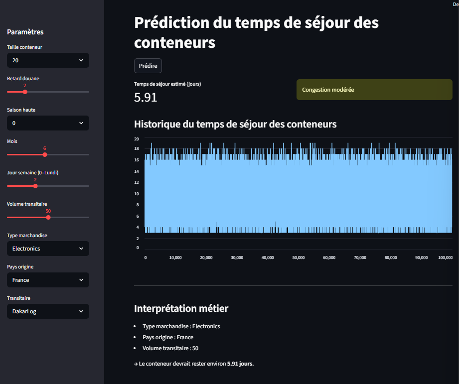

# Prédiction du Temps de Séjour des Conteneurs

## Contexte métier

La gestion des conteneurs dans un port est un enjeu critique pour la fluidité logistique.

Un temps de séjour élevé entraîne :

* congestion des terminaux
* saturation des espaces de stockage
* augmentation des coûts

---

## Problème

Les opérateurs portuaires ont du mal à anticiper la durée de séjour des conteneurs.

---

## Objectif

Développer un modèle permettant de prédire le temps de séjour des conteneurs dès leur arrivée.

---

## Solution Data Science

* Modèle : Random Forest
* Variables :

  * type de conteneur
  * conditions météo
  * niveau de congestion
  * temps d’opération

---

## Technologies

* Python
* Pandas
* Scikit-learn
* Streamlit

---

## Dashboard

Application interactive permettant :

* simulation du temps de séjour
* visualisation des résultats
* interprétation métier

---

## Aperçu

### Dashboard



### Prédiction


---

## Résultats

* prédictions cohérentes avec les conditions opérationnelles
* modèle capable de capturer les facteurs influençant le dwell time

---

## Impact métier

* optimisation de l’espace de stockage
* meilleure planification logistique
* réduction de la congestion

---

## ▶️ Lancer le projet

```bash
pip install -r requirements.txt
streamlit run app.py
```

---

## Structure

```text
container_dwell_time/
```

##  Démo

[Lien vers l'application Streamlit] *https://mes-projets-data-pwxrfg3wlan5d2zjbxsa9r.streamlit.app/*

---

## Contact

N’hésite pas à me contacter pour échanger sur ce projet ou des opportunités.

Ingénieur en transition vers la Data Science, je développe des solutions orientées optimisation logistique et analyse de données.
