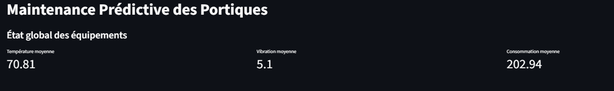
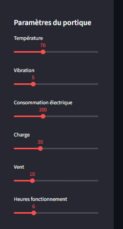

# Maintenance Prédictive des Portiques

## Contexte métier

Dans un port, une panne de grue (portique) peut bloquer toute la chaîne logistique.

L’objectif est de détecter les anomalies avant qu’une panne ne survienne afin d’éviter les arrêts opérationnels.

---

## Problème

Les pannes sont rares mais critiques.
Il est difficile de détecter les signes précurseurs à partir des données capteurs.

---

##  Objectif

Mettre en place un système de détection d’anomalies basé sur les données capteurs :

* température
* vibration
* consommation électrique
* charge

---

## Solution Data Science

* Modèle : Random Forest Classifier
* Détection d’anomalies via feature engineering avancé
* Création d’indicateurs comme :

  * moyenne glissante
  * variation
  * stress mécanique

---

## Technologies

* Python
* Pandas / NumPy
* Scikit-learn
* Streamlit

---

## Dashboard

Application interactive permettant :

* simulation de l’état des portiques
* détection de panne en temps réel
* visualisation des capteurs
* alertes intelligentes

---

## Aperçu

## 🛠️ Fonctionnalités
* **Monitoring IA** : Détection via Random Forest (Supervisé).
* **Détection d'Anomalies** : Isolation Forest pour les comportements inconnus.
* **Dashboard Interactif** : Interface Streamlit avec KPIs en temps réel.

### Aperçu du Dashboard

Voici les différentes sections de l'application :

#### État Global


#### Détection d'Anomalies


#### Historique des Capteurs


#### Analyse de l'État & Filtres




---

## Résultats

* détection efficace des anomalies
* identification des variables critiques (vibration, température)
* système capable d’anticiper les pannes

---

## Impact métier

* réduction des arrêts non planifiés
* amélioration de la disponibilité des équipements
* optimisation de la maintenance

---

## ▶️ Lancer le projet

```bash
pip install -r requirements.txt
streamlit run app.py
```

---

## Structure

```text
crane_anomaly/
├── app.py
├── model.pkl
├── data.csv
├── utils.py
├── requirements.txt
├── screenshots/
└── README.md
```

---

## Contact

N’hésite pas à me contacter pour échanger sur ce projet ou des opportunités.

Ingénieur en transition vers la Data Science, je conçois des solutions basées sur les données pour répondre à des problématiques réelles, notamment dans l’optimisation des systèmes logistiques.

Je suis ouvert à des opportunités où je peux contribuer à des projets à fort impact.
