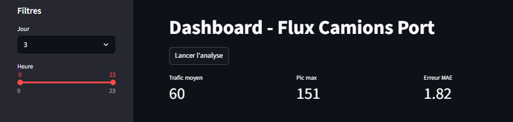
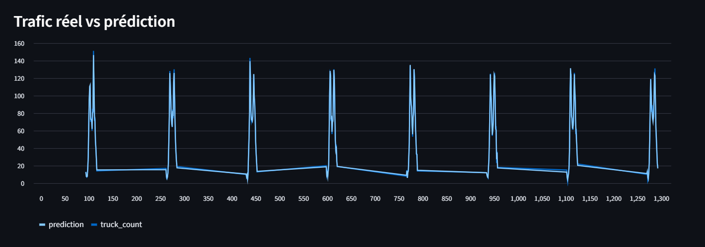
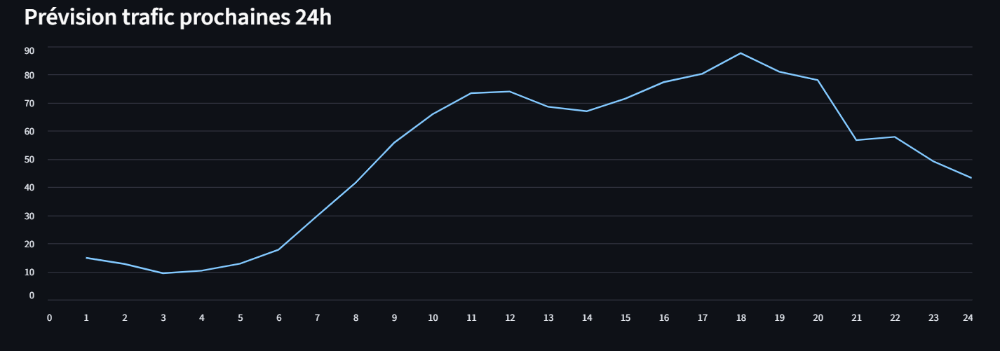
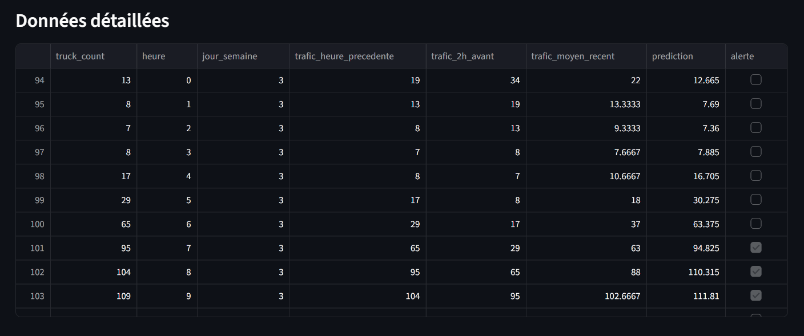
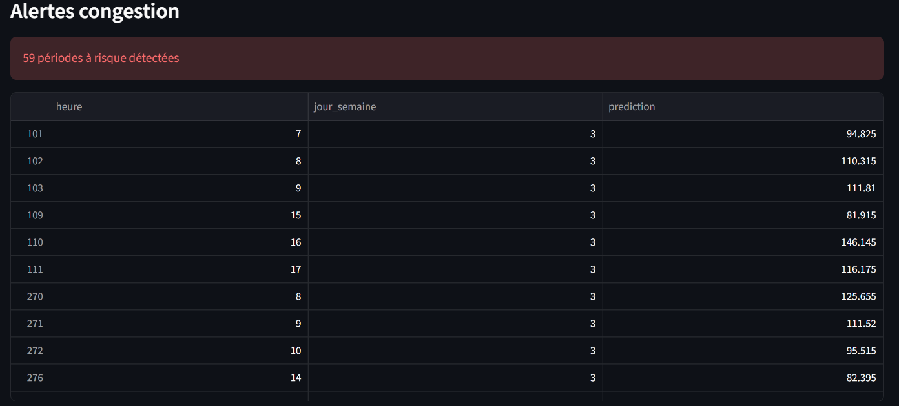

# Optimisation du Flux de Camions — Smart Gate Analytics

## Contexte métier

La congestion des camions aux entrées portuaires est un problème majeur pour des infrastructures comme le Port de Dakar.
Elle entraîne :

* des retards logistiques
* une augmentation des coûts opérationnels
* une mauvaise expérience pour les transporteurs

---

## Problème

Les arrivées de camions sont **irrégulières et difficiles à anticiper**, ce qui provoque :

* des files d’attente importantes
* une surcharge aux heures de pointe
* une mauvaise allocation des ressources (agents, sécurité, gates)

---

## Objectif du projet

Développer un système intelligent permettant de :

* prédire le trafic de camions
* anticiper les pics de congestion
* améliorer la gestion des entrées du port

---

## Solution Data Science

Le projet repose sur deux approches :

### 1️. Machine Learning (Random Forest)

* prédiction du trafic camion à partir de variables :

  * heure
  * jour de la semaine
  * historique récent (lags)
  * moyenne glissante

---

### 2️. Time Series (Prévision 24h)

* prédiction récursive des **24 prochaines heures**
* utilisation des valeurs précédentes comme input

---

## Technologies utilisées

* Python
* Pandas
* Scikit-learn
* Streamlit
* Matplotlib

---

## Fonctionnalités du Dashboard

Application développée avec Streamlit :

### ✔ Visualisation du trafic

* trafic réel vs prédiction
* analyse des tendances

### ✔ KPIs

* trafic moyen
* pic maximum
* erreur du modèle (MAE)

### ✔ Filtres interactifs

* filtrage par jour
* filtrage par heure

### ✔ Prévision des 24 prochaines heures

* anticipation des pics de trafic

### ✔ Alertes de congestion

* détection automatique des périodes critiques

---

## Aperçu de l’application

### Dashboard principal



### Prédictions



### Prévision 24h



### Detaillees



### Alertes



---

## Résultats

* Le modèle capture correctement les tendances du trafic
* Erreur moyenne (MAE) : **faible (≈ 2 à 5 camions)** selon simulation
* Bonne capacité à anticiper les pics horaires

---

## Impact métier

Cette solution permettrait à une autorité portuaire de :

* réduire les temps d’attente des camions
* améliorer la fluidité du trafic
* optimiser la gestion des ressources
* mettre en place un système de créneaux horaires (slot booking)

---

## ▶️ Lancer le projet

### 1. Installer les dépendances

```bash
pip install -r requirements.txt
```

---

### 2. Lancer l’application

```bash
streamlit run app.py
```

---

## Structure du projet

```
truck_flow/
│
├── app.py
├── model.pkl
├── data.csv
├── utils.py
├── requirements.txt
├── screenshots/
└── README.md

```

##  Démo

[Lien vers l'application Streamlit] *https://mes-projets-data-decaxys8igehqj6dovgh7b.streamlit.app/*

---

## Améliorations possibles

* utilisation de modèles avancés (LSTM)
* intégration de données réelles (GPS, météo)
* déploiement cloud
* API pour intégration avec systèmes portuaires

---

## Compétences démontrées

* Data analysis (EDA)
* Feature engineering
* Machine Learning
* Time Series forecasting
* Data visualization
* Déploiement d’application (Streamlit)

---

## Contact

N’hésite pas à me contacter pour échanger sur ce projet ou des opportunités.

Ingénieur en transition vers la Data Science, je conçois des solutions basées sur les données pour répondre à des problématiques réelles, notamment dans l’optimisation des systèmes logistiques.

Je suis ouvert à des opportunités où je peux contribuer à des projets à fort impact.


---
