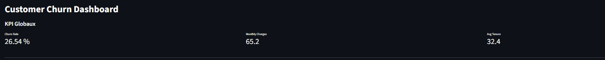
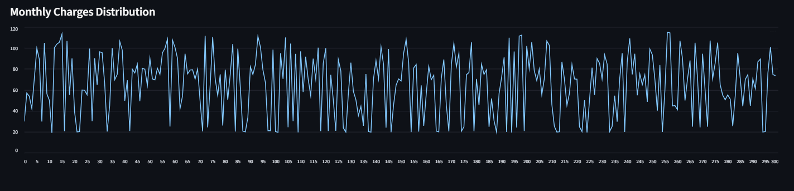

# Customer Churn Prediction & Decision Dashboard

## Objectif du projet
Ce projet vise à **prédire le churn des clients télécom** et à fournir un **outil d’aide à la décision** pour améliorer la rétention client.

Contrairement à une simple application de Machine Learning, ce dashboard permet :
- d’identifier les clients à risque
- de comprendre les facteurs de churn
- de simuler des scénarios clients
- de proposer des actions business

### Dataset
- Source : IBM Telco Customer Churn (Kaggle)
- 7000+ clients
- Variables : démographiques, services, facturation

### Feature Engineering
- `tenure_group` : segmentation clients
- `charge_ratio` : détection anomalies facturation
- `ARPU` : revenu moyen par utilisateur

### Modélisation
- Modèle : Logistic Regression
- Gestion déséquilibre : `class_weight='balanced'`
- Optimisation métier : ajustement du seuil (0.3)

### Performance
- Recall churn : **93%**
- Accuracy : 63%
- Objectif : maximiser la détection des clients à risque

---

## Dashboard (:contentReference[oaicite:0]{index=0})

### Fonctionnalités
- KPI globaux (churn rate, charges, ancienneté)
- Filtres interactifs (contrat, churn)
- Visualisations (churn par segment)
- Simulation client en temps réel
- Recommandations business

## Tech Stack
- Python
- Scikit-learn
- Streamlit
- Pandas

---

## Exemple d’utilisation

1. Sélectionner les caractéristiques d’un client
2. Lancer la prédiction
3. Obtenir :
   - probabilité de churn
   - niveau de risque
   - recommandations

---

## 📱 Aperçu de l'Application


| Analyse des KPIs | Simulateur de Prédiction |
| :---: | :---: |
|  |  |


## Insights métier

- Les clients avec contrat **Month-to-month** churnent davantage
- Les nouveaux clients sont plus à risque
- Les charges élevées augmentent le churn
- Les anomalies de facturation sont un signal critique

---

## Contact

N’hésitez pas à me contacter pour échanger sur ce projet ou sur des opportunités dans le domaine de la data appliquée aux télécommunications.

Ingénieur en transition vers la Data Science, je développe des solutions basées sur les données pour répondre à des problématiques concrètes, notamment autour de la **rétention client, de l’analyse du churn et de l’optimisation de la valeur client** dans le secteur télécom.

Je suis particulièrement intéressé par des projets à fort impact permettant d’exploiter la donnée pour améliorer la prise de décision, optimiser les performances commerciales et renforcer la satisfaction client.

Je reste ouvert à toute opportunité où je peux apporter une contribution concrète grâce à une approche orientée data et métier.


## Installation

```bash
git clone https://github.com/ton-repo/customer-churn.git
cd customer-churn
pip install -r requirements.txt
streamlit run app.py

---

